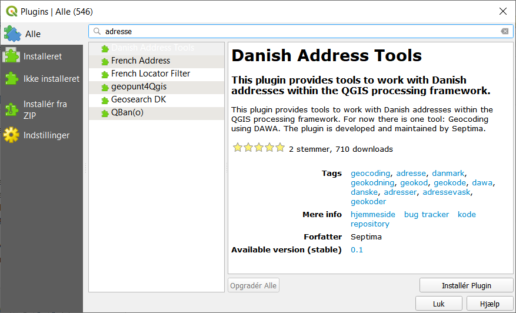
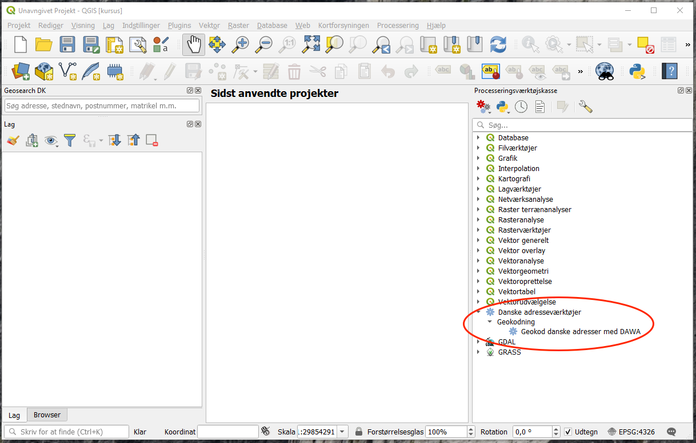
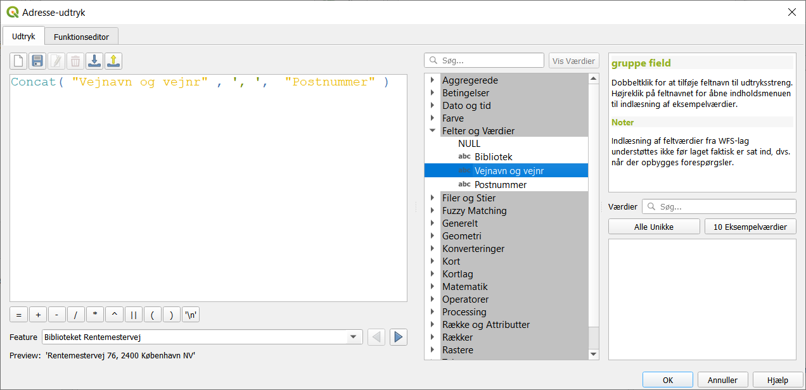
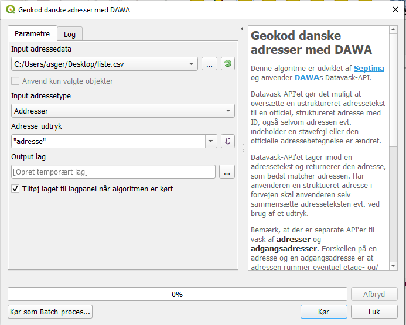

# Danske adresser i QGIS
## Download pluginet
Dette plugin kan hentes fra QGIS' officielle Plugin Respository direkte fra QGIS. Søg efter 'adresse' og klik dernæst på 'Installér Plugin'

Dette plugin til QGIS installerer en såkaldt "udbyder", der udstiller værktøjer til brug i "Processering".

For at bruge et værktøj når pluginet er installeret, skal du først aktivere "Værktøjskassen" under "Processering" (engelsk: "Toolbox" under "Processing"). Derefter findes værktøjerne i værktøjskassen.

## Algoritmer
Denne provider udstiller én algoritme.

### Geokod danske adresser med Adressevask
Denne algoritme anvender Klimadatastyrelsens <a href="https://confluence.kds.dk/display/ADV/Adressevask">Adressevask</a>- og <a href="https://confluence.kds.dk/pages/viewpage.action?pageId=246743156">Adressevælger</a>-API'er.

Med pluginet kan man oversætte en ustruktureret adressetekst til en officiel adresse fra Danmarks Adresseregister (DAR). Det håndterer stavefejl og situationer, hvor den officielle adressebetegnelse er ændret.

Pluginet tager imod en adressetekst og returnerer dén adresse, som bedst matcher. Hvis adresseteksten, som skal geokodes, står i eet felt angives dette blot under "Adresse-udtryk". Findes adresseteksten derimod i flere felter i attributtabellen, fx vejnavn i et felt, husnummer i et andet felt og postnummer i et tredje felt, så skal disse sættes sammen til et samlet adresseudtryk vha. udtryksbyggeren (som du åbner ved at klikke på epsilon-ikonet).

Her er et eksempel, hvor adressen findes i de to felter "Vejnavn og vejnr" og "Postnummer". Funktionen Concat() bruges til at sammensætte disse to felter opdelt med et komma.

Algoritmen vasker adressen og slår den herefter op hos Adressevælger i samme kald, så outputtet indeholder både adresse-id og den fulde mængde af adresseoplysninger (vejnavn, postnummer, kommunekode, adgangspunktets koordinater m.m.) - der er ikke brug for et separat opslagsværktøj.

En gyldig adresse kan skrives på forskellige måder (varianter). Man kan fx vælge at udelade det supplerende bynavn, eller at bruge det forkortede "adresseringsvejnavn" i stedet for det fulde vejnavn.

Adressevask svar angiver hvor sikkert svaret er, i form af en vaskestatus-kode og -tekst, der erstatter DAWAs gamle A/B/C-kategorier. Positive koder (fx 1000, 900, 800, 700) angiver en eller anden grad af match, negative koder betyder at adressen ikke kunne vaskes. Vaskestatus_kode og vaskestatus_tekst sættes altid på outputtet, også når adressen ikke kunne vaskes - i så fald er de øvrige adressefelter og geometrien tomme.

Resultaterne fordeles på fire outputlag efter vaskestatus_kode, så de kan kvalitetsvurderes hver for sig: Kvalitet 1 (kode 1000, eksakt match), Kvalitet 2 (kode 900, tilnærmet vejnavn), Kvalitet 3 (kode 700/800, interval-adresse) og Fejl (negativ kode, eller ingen adresse at vaske).

Adressevask anvender også DAR’s historiske adresser som datagrundlag, således at adresser som er ændret også kan vaskes. Matcher adresseteksten en historisk adressebetegnelse, angives den tidligere adressebetegnelse i feltet historisk_adressebetegnelse, mens de øvrige felter altid indeholder adressens aktuelle betegnelse og oplysninger.

Koordinaterne for adgangspunktet leveres i ETRS89 / UTM zone 32N (EPSG:25832).

Anvendelsen er demonstreret i denne film:

Du kan teste pluginet med dette demodatasæt, der indeholder adresser på en række biblioteker i København.

## Fejl eller ønsker til forbedring?
Oplever du en fejl i pluginet, så må du meget gerne oprettet en fejlbeskrivelse i pluginets <a href="https://github.com/Septima/qgis-addresstoolsdk/issues">Issuetracker</a>.

Har du en idé til en forbedring, så skriv til kontakt@septima.dk eller opret dit ønske i pluginets <a href="https://github.com/Septima/qgis-addresstoolsdk/issues">Issuetracker</a>. 

Septima vil med glæde tilbyde sin bistand til rettelser af fejl og forbedring.

I pluginets <a href="https://github.com/Septima/qgis-addresstoolsdk/issues">Issuetracker</a> kan du også se eksistrende registreringer af idéer og bugs.
