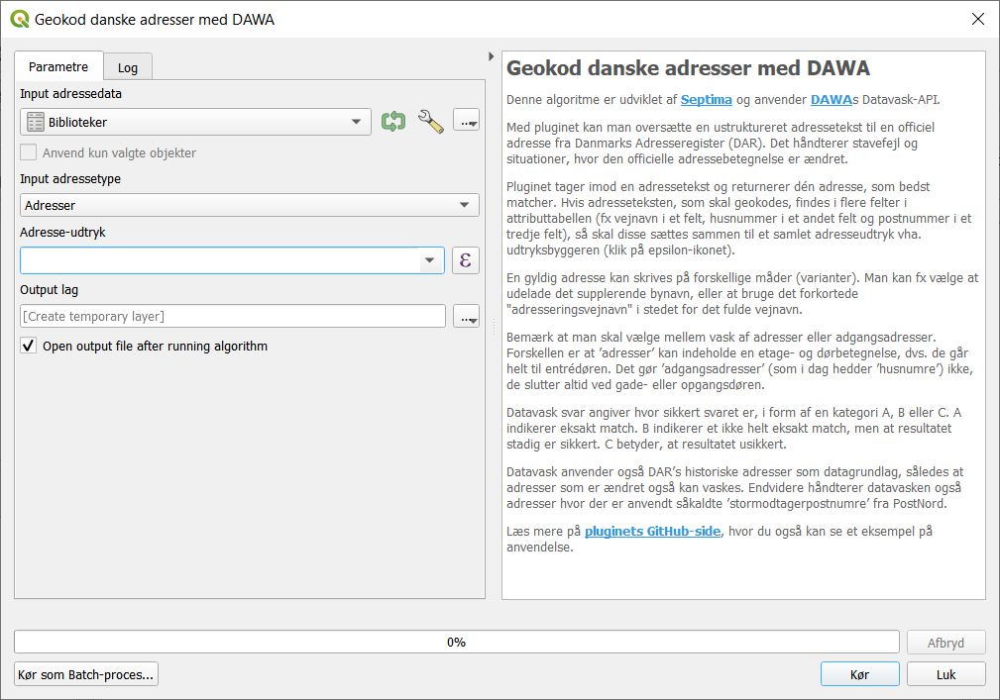

# Danske adresser i QGIS
## Download pluginet
Dette plugin kan hentes fra QGIS' officielle Plugin Respository direkte fra QGIS. Søg efter 'adresse' og klik dernæst på 'Installér Plugin'

Dette plugin til QGIS installerer en såkaldt "udbyder", der udstiller værktøjer til brug i "Processering".

For at bruge et værktøj når pluginet er installeret, skal du først aktivere "Værktøjskassen" under "Processering" (engelsk: "Toolbox" under "Processing"). Derefter findes værktøjerne i værktøjskassen.

## Algoritmer
Indtil videre udstiller denne provider én algoritme.

### Geokod danske adresser med DAWA
Denne algoritme anvender <a href="https://dawa.aws.dk/">DAWAs</a> Datavask-API.

Med pluginet kan man oversætte en ustruktureret adressetekst til en officiel adresse fra Danmarks Adresseregister (DAR). Det håndterer stavefejl og situationer, hvor den officielle adressebetegnelse er ændret.

Pluginet tager imod en adressetekst og returnerer dén adresse, som bedst matcher. Hvis adresseteksten, som skal geokodes, står i eet felt angives dette blot under "Adresse-udtryk". Findes adresseteksten derimod i flere felter i attributtabellen, fx vejnavn i et felt, husnummer i et andet felt og postnummer i et tredje felt, så skal disse sættes sammen til et samlet adresseudtryk vha. udtryksbyggeren (som du åbner ved at klikke på epsilon-ikonet).

Her er et eksempel, hvor adressen findes i de to felter "Vejnavn og vejnr" og "Postnummer". Funktionen Concat() bruges til at sammensætte disse to felter opdelt med et komma.

En gyldig adresse kan skrives på forskellige måder (varianter). Man kan fx vælge at udelade det supplerende bynavn, eller at bruge det forkortede "adresseringsvejnavn" i stedet for det fulde vejnavn.

Bemærk at man skal vælge mellem vask af adresser eller adgangsadresser. Forskellen er at ’adresser’ kan indeholde en etage- og dørbetegnelse, dvs. de går helt til entrédøren. Det gør ’adgangsadresser’ (som i dag hedder ’husnumre’) ikke, de slutter altid ved gade- eller opgangsdøren. Du vælger om det skal være adresse eller adgangsadresse i dropdown ved 'Input adressetype'.

Datavask svar angiver hvor sikkert svaret er, i form af en kategori A, B eller C. A indikerer eksakt match. B indikerer et ikke helt eksakt match, men at resultatet stadig er sikkert. C betyder, at resultatet usikkert. 

Datavask anvender også DAR’s historiske adresser som datagrundlag, således at adresser som er ændret også kan vaskes. Endvidere håndterer datavasken også adresser hvor der er anvendt såkaldte ’stormodtagerpostnumre’ fra PostNord. 

Anvendelsen er demonstreret i denne film:

Du kan teste pluginet med dette demodatasæt, der indeholder adresser på en række biblioteker i København.

## Fejl eller ønsker til forbedring?
Oplever du en fejl i pluginet, så må du meget gerne oprettet en fejlbeskrivelse i pluginets <a href="https://github.com/Septima/qgis-addresstoolsdk/issues">Issuetracker</a>.

Har du en idé til en forbedring, så skriv til kontakt@septima.dk eller opret dit ønske i pluginets <a href="https://github.com/Septima/qgis-addresstoolsdk/issues">Issuetracker</a>. 

Septima vil med glæde tilbyde sin bistand til rettelser af fejl og forbedring.

I pluginets <a href="https://github.com/Septima/qgis-addresstoolsdk/issues">Issuetracker</a> kan du også se eksistrende registreringer af idéer og bugs.
